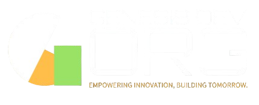

# 

## Hi there 👋
Welcome to **Genesis Dev Org**, an open-source organization based in Malawi, dedicated to empowering developers, fostering collaboration, and driving technological innovation for sustainable development.

---

## 🌟 **Our Mission**

Our mission is to drive technological advancement in Malawi through open-source solutions, fostering collaboration, empowering developers, and building a community that leverages technology to solve local and global challenges.

---

## 👁️ **Our Vision**

To be the leading open-source organization in Malawi, creating a thriving ecosystem where innovation, inclusivity, and technology empower communities and drive sustainable development across Africa.

---

## 🎯 **Core Values**

- **Innovation**: Developing cutting-edge solutions for modern challenges.
- **Collaboration**: Building a community where developers, designers, and innovators thrive together.
- **Inclusivity**: Creating opportunities for everyone, regardless of background.
- **Sustainability**: Leveraging technology for long-term impact.

---

## 🛠️ **What We Do**

- **Open-Source Projects**: We develop and maintain open-source tools and platforms for various industries.
- **Developer Training**: We host workshops, hackathons, and training programs to empower Malawian developers.
- **Community Building**: We foster collaboration through meetups, events, and mentorship.
- **Technology Advocacy**: Promoting the adoption of open-source technology across Malawi and beyond.
- **Research and Innovation**: Conducting research to address local challenges and developing innovative solutions tailored to the Malawian and African context.

---

## 💻 **Tech Stack**

Our organization currently supports the following technologies:

### **Programming Languages**:
  
 >
  
  
  
  
  )
  
  
  
### **Frameworks**: 
 >
  
  
  
  

  
### **Databases**:
 >
  
  
  
  
  

  
### **Version Control**:
 >
  
  
### **Mobile Development**:
 >
  
  
### **Other Tools**:
 >
  
  
  
  
  
  
  
  

We are always open to exploring and adopting new technologies to expand our impact.

---

## 🚀 **Get Involved**

We welcome contributors from all skill levels! Here's how you can get started:

1. **Fork this repository** and explore our projects.
2. Check out our **issues** tab for open tasks and contribute.
3. Join our community by participating in discussions, meetups, and events.

---

## 🤝 **Collaboration Opportunities**

We’re open to collaborating with:
- Developers passionate about open-source.
- Organizations looking to build scalable solutions.
- Sponsors to support community initiatives.

---

## 📬 **Contact Us**

Feel free to reach out to us with questions, ideas, or partnership opportunities:

- **Email**: [contact@genesisdev.org](mailto:contact@genesisdev.org)
- **Website**: [www.genesisdev.org](https://www.genesisdev.org)
- **Social Media**: Follow us on [Twitter](https://twitter.com/genesisdevorg) and [LinkedIn](https://linkedin.com/company/genesisdevorg).

---

## 📄 **License**

This organization and all associated projects are licensed under the [MIT License](LICENSE). Feel free to use, modify, and distribute our code!

---

### 🙌 **Thank You for Supporting Genesis Dev Org!**

Together, we can shape the future of technology in Malawi and beyond. 💡

<!--

**Here are some ideas to get you started:**

🙋‍♀️ A short introduction - what is your organization all about?
🌈 Contribution guidelines - how can the community get involved?
👩‍💻 Useful resources - where can the community find your docs? Is there anything else the community should know?
🍿 Fun facts - what does your team eat for breakfast?
🧙 Remember, you can do mighty things with the power of [Markdown](https://docs.github.com/github/writing-on-github/getting-started-with-writing-and-formatting-on-github/basic-writing-and-formatting-syntax)
-->
